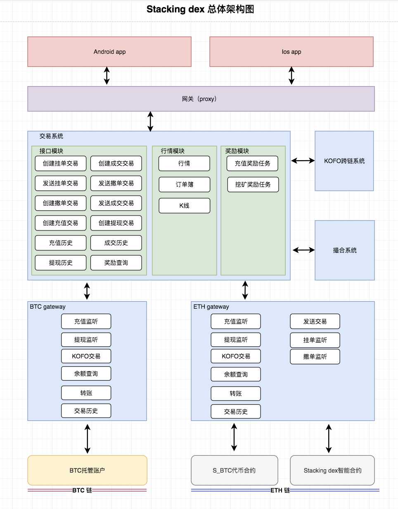
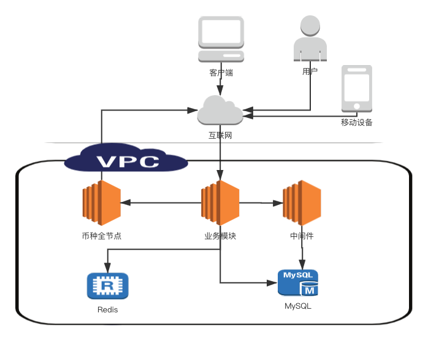

## Deployment


### 业务架构图



### 模块部署图



### 组件模块

|  应用模块  |  中间件模块  |  数据库模块  |
|  -------  |  -----  | ----  |
|  job  |  emqtt  |    redis   |
|  ethgateway  |   apollo   |      |
|  ethwatchonly  |   zookeeper    |    |
|  proxy  |  eureka    |    |
|  sequence   |   eth-fullnode    |    |
|  btcgateway   |   btc-fullnode    |    |
|  btcwatchonly   |       |    |
|  application   |       |    |
|  match   |       |    |
|  quotation   |       |  mysql  |

### 硬件需求

|应用|  系统  |  CPU  |  内存  |磁盘|
|-------|-------|-------|-------|-------|
| full-node | centos7 | 8 | 16g | 500g |
| MySql |  | 8 | 16g | 500g |
| Redis |  | 4 | 8g | 10g |
| 业务模块（一台服务器可混部2个） | centos7 | 4 | 8g | 200g |
| 中间件硬件需求请参考官方 |  |  |  | ||


### 中间件搭建参考
[emqtt](https://docs.emqx.io/broker/latest/cn/getting-started/installation.html)

[apollo](https://github.com/ctripcorp/apollo/wiki/Quick-Start)

[zookeeper](https://zookeeper.apache.org/doc/r3.6.0/zookeeperStarted.html)

[eureka](https://github.com/Netflix/eureka/wiki/Building-Eureka-Client-and-Server)

[eth-fullnode](https://github.com/ethereum/go-ethereum)

[btc-fullnode](https://bitcoin.org/en/full-node#linux-instructions)

### 数据库
Redis和MySQL可自建或者使用云服务，~~安装过程不做介绍~~

MySQL DB表初始化(初始sql位于本仓库sql目录下)：
```
for i in `ls sql`
do
	db=`echo $i|awk -F'.' '{print $1}'`
	mysql -uroot -pxxxx -e 'create database $db'
	mysql -uroot  -pxxxx $db < $i
done
```

### 配置文件
请将本仓库conf目录下文本文件导入Apollo，~~[apollo使用参考](https://github.com/ctripcorp/apollo/wiki/Quick-Start)~~

### 应用模块（均为Java编写）
#### 1.构建部署
1. 通过maven构建生成Jar文件
```
mvn -Dmaven.test.skip=true clean package
```
2. 将步骤1构建的Jar包上传到服务器用户目录下
```
/data/staking/
```

#### 2.维护
1.启动
```
nohup java -jar -Dapollo.meta=http://xxxx:8080 -Denv=DEV -Dapollo.cluster=default xx.jar > /dev/null &
```
2. 停止
```
kill -2 `pgrep -f xx.jar `
```
3. 查看状态
```
jps
ps -eo pid,etime,comm|grep 进程号
```

#### 3.example
```
[admin@ application]$ pwd
/data/staking/application
[admin@ application]$ ll
drwxrwxr-x 2 admin admin      4096 Mar 31 15:06 logs
-rw-r--r-- 1 admin admin 103127669 Mar 31 15:26 staking-application.jar
-rw-rw-r-- 1 admin admin         6 Mar 31 15:29 staking-application.pid
-rw-rw-r-- 1 admin admin         0 Mar 31 15:30 status
[admin@ application]$ pgrep -f staking-application.jar
23602
[admin@ application]$ ps -eo pid,etime,comm|grep 23602
23602       46:15 java
```
